# Baby Steps Tutorial: Building Your First Saga with Domain + ServiceResult

**Learn by doing - we'll build a simple user signup step by step.**

## What We're Building

A **User Signup** that does 2 things:
1. ✅ **Create user** (must work or everything fails)
2. 📧 **Send welcome email** (nice to have, don't fail if email breaks)


---

## Baby Step 1: Add Dependencies

**What:** Add the libraries to your project  
**Why:** We need both domain utilities and saga orchestration

```xml
<dependencies>
    <dependency>
        <groupId>com.catalis</groupId>
        <artifactId>lib-common-domain</artifactId>
        <version>1.0.0-SNAPSHOT</version>
    </dependency>
    <dependency>
        <groupId>com.catalis</groupId>
        <artifactId>lib-transactional-engine</artifactId>
        <version>1.0.0-SNAPSHOT</version>
    </dependency>
</dependencies>
```

---

## Baby Step 2: Enable the Libraries

**What:** Turn on auto-configuration  
**Why:** This sets up all the beans we need

```java
@Configuration
@EnableTransactionalEngine  // Enables saga orchestration
public class AppConfig {
    // lib-common-domain is auto-enabled when on classpath
}
```

---

## Baby Step 3: Create Your Data Objects

**What:** Define what data flows through your saga  
**Why:** Type safety and clear contracts

```java
// Input for creating a user
public record CreateUserRequest(String email, String name) {}

// Input for sending email
public record SendEmailRequest(String email, String name) {}
```

---

## Baby Step 4: Create a Simple Service

**What:** A service that can fail gracefully  
**Why:** ServiceResult lets us handle failures without exceptions

```java
@Service
public class UserService {
    
    public ServiceResult<String> createUser(String email, String name) {
        return ServiceResult.of(() -> {
            // Simulate saving to database
            String userId = "user-" + System.currentTimeMillis();
            log.info("Created user: {} with email: {}", userId, email);
            return userId;
        });
    }
    
    public ServiceResult<Void> deleteUser(String userId) {
        return ServiceResult.of(() -> {
            log.info("Deleted user: {}", userId);
            return null;
        });
    }
}
```

**Key Point:** `ServiceResult.of()` catches exceptions and turns them into failure results.

---

## Baby Step 5: Create an Email Service

**What:** A service for optional operations  
**Why:** Email might fail, but we don't want to break user creation

```java
@Service
public class EmailService {
    
    public ServiceResult<Void> sendWelcomeEmail(String email, String name) {
        return ServiceResult.of(() -> {
            // Simulate email sending (might fail)
            if (email.contains("bad")) {
                throw new RuntimeException("Email service down");
            }
            log.info("Sent welcome email to: {}", email);
            return null;
        });
    }
}
```

---

## Baby Step 6: Build Your First Saga

**What:** Orchestrate the two operations  
**Why:** Saga handles the workflow and rollback if needed

```java
@Saga(name = "UserSignupSaga")
@Service
public class UserSignupSaga {
    
    private final UserService userService;
    private final EmailService emailService;
    
    // Step 1: Create user (CRITICAL)
    @SagaStep(id = "createUser", compensate = "deleteUser")
    public Mono<String> createUser(@Input CreateUserRequest request, SagaContext ctx) {
        return Mono.fromCallable(() -> userService.createUser(request.email(), request.name()))
            .flatMap(result -> {
                if (result.isSuccess()) {
                    return Mono.just(result.getData().orElseThrow());
                } else {
                    // Fail the saga - this is critical
                    return Mono.error(new RuntimeException(result.getError().orElse("User creation failed")));
                }
            });
    }
    
    // Step 2: Send email (OPTIONAL)
    @SagaStep(id = "sendEmail", dependsOn = {"createUser"})
    public Mono<Void> sendEmail(@Input SendEmailRequest request, SagaContext ctx) {
        return Mono.fromCallable(() -> emailService.sendWelcomeEmail(request.email(), request.name()))
            .flatMap(result -> {
                if (result.isSuccess()) {
                    log.info("Email sent successfully");
                } else {
                    // Just log - don't fail the saga
                    log.warn("Email failed: {}", result.getError().orElse("Unknown"));
                }
                return Mono.empty();
            });
    }
    
    // Compensation: Delete user if something fails
    public Mono<Void> deleteUser(@Input CreateUserRequest request, 
                                 @FromStep("createUser") String userId, 
                                 SagaContext ctx) {
        return Mono.fromCallable(() -> userService.deleteUser(userId))
            .flatMap(result -> {
                if (result.isSuccess()) {
                    log.info("User rollback completed");
                } else {
                    log.error("Rollback failed: {}", result.getError().orElse("Unknown"));
                }
                return Mono.empty();
            });
    }
}
```

**Key Points:**
- `@SagaStep` marks each operation
- `compensate` defines what to do if we need to rollback
- `dependsOn` controls the order
- Critical steps throw exceptions, optional steps just log

---

## Baby Step 7: Create the Command

**What:** The main entry point for your business operation  
**Why:** @CommandQuery marks this as a state-changing operation

```java
@CommandQuery("Signs up a new user")
@Service
public class SignupUserCommand {
    
    private final SagaEngine sagaEngine;
    
    public void execute(String email, String name) {
        // Validate input
        new BusinessValidator()
            .notBlank(email, "Email required")
            .notBlank(name, "Name required")
            .validate();
        
        // Prepare saga inputs
        StepInputs inputs = StepInputs.builder()
            .forStepId("createUser", new CreateUserRequest(email, name))
            .forStepId("sendEmail", new SendEmailRequest(email, name))
            .build();
        
        // Run the saga
        SagaResult result = sagaEngine.execute("UserSignupSaga", inputs, new SagaContext()).block();
        
        if (!result.isSuccess()) {
            throw new RuntimeException("Signup failed: " + result.getError().orElse("Unknown"));
        }
        
        log.info("Signup completed successfully!");
    }
}
```

---

## Baby Step 8: Test It!

**What:** Try your saga with different scenarios  
**Why:** See how it handles success and failure

```java
@RestController
public class TestController {
    
    private final SignupUserCommand signupCommand;
    
    @PostMapping("/signup")
    public String signup(@RequestParam String email, @RequestParam String name) {
        try {
            signupCommand.execute(email, name);
            return "Success! User created and email sent.";
        } catch (Exception e) {
            return "Failed: " + e.getMessage();
        }
    }
}
```

**Test scenarios:**
- ✅ Normal: `POST /signup?email=john@test.com&name=John` → Should work
- ❌ Bad email: `POST /signup?email=bad@test.com&name=John` → Email fails, but user still created
- ❌ Empty name: `POST /signup?email=john@test.com&name=` → Validation fails, nothing happens

---

## What Happens When Things Fail?

### Scenario 1: Email Fails (Optional Step)

```mermaid
sequenceDiagram
    participant C as Command
    participant S as Saga
    participant U as UserService
    participant E as EmailService
    
    C->>S: Start saga
    S->>U: Create user
    U-->>S: ✅ Success (userId)
    S->>E: Send email
    E-->>S: ❌ Failed
    S-->>C: ✅ Saga success (email failure logged)
```


### Scenario 2: User Creation Fails (Critical Step)


---

## Key Patterns You Just Learned

### 1. **Critical vs Optional Steps**
```java
// Critical: Throw exception if ServiceResult fails
if (result.isSuccess()) {
    return Mono.just(result.getData().orElseThrow());
} else {
    return Mono.error(new RuntimeException(result.getError().orElse("Failed")));
}

// Optional: Log and continue
if (result.isSuccess()) {
    log.info("Success!");
} else {
    log.warn("Failed but continuing: {}", result.getError().orElse("Unknown"));
}
return Mono.empty();
```

### 2. **Graceful Compensation**
```java
// Always handle compensation failures gracefully
if (result.isSuccess()) {
    log.info("Compensation completed");
} else {
    log.error("Compensation failed: {}", result.getError().orElse("Unknown"));
    // Don't throw - let other compensations run
}
return Mono.empty();
```

---

## Adding a Query (Bonus Step)

**What:** Read data without changing anything  
**Why:** @ViewQuery marks read-only operations

```java
@ViewQuery("Gets user signup status")
@Service
public class GetUserStatusQuery {
    
    private final UserRepository userRepository;
    
    public String execute(String email) {
        new BusinessValidator()
            .notBlank(email, "Email required")
            .validate();
        
        ServiceResult<User> result = ServiceResult.of(() -> 
            userRepository.findByEmail(email)
                .orElseThrow(() -> new RuntimeException("User not found")));
        
        return result.isSuccess() ? "FOUND" : "NOT_FOUND";
    }
}
```

---

## Next Steps

Now you can:
1. Add more steps to your saga
2. Use DomainEvent for publishing events
3. Add more complex ServiceResult patterns with `.recoverWith()`
4. Handle multiple fallback strategies

**Remember:** Start simple, then add complexity as needed!

---

## Quick Reference

| Component | Purpose | When to Use |
|-----------|---------|-------------|
| `@CommandQuery` | State-changing operations | Commands, saga orchestrators |
| `@ViewQuery` | Read-only operations | Queries, lookups |
| `ServiceResult` | Operations that might fail | External APIs, database calls |
| `BusinessValidator` | Input validation | Before any business logic |
| `@SagaStep` | Saga operations | Each step in your workflow |
| `DomainEvent` | Business events | Success/failure notifications |

**Golden Rule:** Use ServiceResult for expected failures, throw exceptions for saga failures.