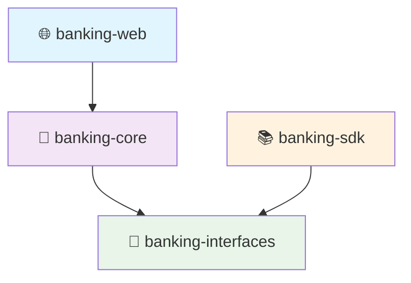

# 🏗️ Microservice Package Structure Guide

> **A comprehensive guide for structuring microservices with Firefly Common Domain Library, featuring CQRS patterns and Saga orchestration aligned with core-infrastructure standards.**

---

## 📋 Table of Contents

- [🎯 Overview](#-overview)
- [🏢 Multimodule Maven Structure](#-multimodule-maven-structure)
- [📦 Module-Specific Package Organization](#-module-specific-package-organization)
- [🔗 Dependency Management](#-dependency-management)
- [⚙️ Configuration Structure](#️-configuration-structure)
- [🧪 Testing Strategy](#-testing-strategy)
- [💡 Implementation Examples](#-implementation-examples)
- [✅ Best Practices](#-best-practices)

---

## 🎯 Overview

This guide presents a **core-infrastructure aligned** microservice structure that leverages the full power of the Firefly Common Domain Library. The architecture follows clean architecture principles with clear separation of concerns across multiple Maven modules.

### 🏛️ Architecture Principles

| Principle | Description |
|-----------|-------------|
| **🎯 Separation of Concerns** | Each module has a single, well-defined responsibility |
| **⬅️ Dependency Direction** | Dependencies flow inward: `web → core → interfaces` |
| **🔄 CQRS Implementation** | Commands and queries are properly separated by domain |
| **🔀 Saga Orchestration** | Business workflows managed through saga patterns |
| **🏗️ Domain-Driven Design** | Business logic centralized in the core module |
| **🔌 Service-Oriented** | Focus on service orchestration vs. data persistence |

### 🎨 Core-Infrastructure Alignment

This structure aligns with Firefly's core-infrastructure patterns:
- ✅ **Interface/Implementation Separation** - Core interfaces in root, implementations in `impl/`
- ✅ **Functional Package Organization** - Specialized packages like `publisher/`, `listener/`, `properties/`
- ✅ **Clean Architecture Layers** - Domain, Application, and Infrastructure separation
- ✅ **Service Client Patterns** - Following ServiceClient library conventions

---

## 🏢 Multimodule Maven Structure

### 📁 Project Structure Overview

```
banking-service/
├── 📄 pom.xml                               # Parent POM Configuration
├── 📦 banking-interfaces/                   # 🔗 DTOs, Enums, API Contracts
├── 🏗️ banking-core/                         # 🧠 Business Logic, CQRS, Sagas, Tests
├── 📚 banking-sdk/                          # 🔌 OpenAPI Generated SDK
└── 🌐 banking-web/                          # 🎮 Controllers, REST APIs
```

### 📊 Module Responsibilities

| Module | Purpose | Dependencies | Key Features |
|--------|---------|--------------|--------------|
| **🔗 interfaces** | Shared contracts & DTOs | Minimal (validation, serialization) | Type-safe contracts |
| **🧠 core** | Business logic & orchestration | interfaces + Firefly libraries | CQRS, Sagas, Service clients |
| **📚 sdk** | External consumer SDK | interfaces | OpenAPI generated clients |
| **🌐 web** | REST API endpoints | core + interfaces | Thin controllers, validation |

### 🔧 Parent POM Configuration

```xml
<?xml version="1.0" encoding="UTF-8"?>
<project xmlns="http://maven.apache.org/POM/4.0.0"
         xmlns:xsi="http://www.w3.org/2001/XMLSchema-instance"
         xsi:schemaLocation="http://maven.apache.org/POM/4.0.0
         http://maven.apache.org/xsd/maven-4.0.0.xsd">
    <modelVersion>4.0.0</modelVersion>

    <groupId>com.company.banking</groupId>
    <artifactId>banking-service</artifactId>
    <version>1.0.0-SNAPSHOT</version>
    <packaging>pom</packaging>

    <modules>
        <module>banking-interfaces</module>
        <module>banking-core</module>
        <module>banking-sdk</module>
        <module>banking-web</module>
    </modules>

    <properties>
        <!-- ☕ Java 21 Configuration -->
        <maven.compiler.source>21</maven.compiler.source>
        <maven.compiler.target>21</maven.compiler.target>
        <java.version>21</java.version>

        <!-- 📚 Framework Versions -->
        <spring.boot.version>3.2.0</spring.boot.version>
        <firefly.version>1.0.0-SNAPSHOT</firefly.version>

        <!-- 🔧 Build Configuration -->
        <project.build.sourceEncoding>UTF-8</project.build.sourceEncoding>
        <maven.compiler.release>21</maven.compiler.release>
    </properties>

    <dependencyManagement>
        <dependencies>
            <!-- 🌱 Spring Boot BOM -->
            <dependency>
                <groupId>org.springframework.boot</groupId>
                <artifactId>spring-boot-dependencies</artifactId>
                <version>${spring.boot.version}</version>
                <type>pom</type>
                <scope>import</scope>
            </dependency>

            <!-- 🔥 Firefly Common Domain Library -->
            <dependency>
                <groupId>com.firefly</groupId>
                <artifactId>lib-common-domain</artifactId>
                <version>${firefly.version}</version>
            </dependency>

            <!-- 🔄 Firefly Transactional Engine -->
            <dependency>
                <groupId>com.firefly</groupId>
                <artifactId>lib-transactional-engine</artifactId>
                <version>${firefly.version}</version>
            </dependency>
        </dependencies>
    </dependencyManagement>
</project>
```

---

## 📦 Module-Specific Package Organization

### 1. 🔗 banking-interfaces Module

> **Purpose**: Contains DTOs, enums, and contracts shared across modules.
>
> **Key Principle**: Minimal dependencies - only validation and serialization libraries.

#### 📁 Package Structure

```
banking-interfaces/
├── 📄 pom.xml
└── src/main/java/com/company/banking/interfaces/
    ├── 📋 dto/                              # Data Transfer Objects
    │   ├── 📥 request/                      # Request DTOs
    │   │   ├── CreateAccountRequest.java
    │   │   ├── CustomerRegistrationRequest.java
    │   │   └── TransferMoneyRequest.java
    │   ├── 📤 response/                     # Response DTOs
    │   │   ├── AccountResponse.java
    │   │   ├── CustomerResponse.java
    │   │   └── TransactionResponse.java
    │   └── 🔄 internal/                     # Internal DTOs (between modules)
    │       ├── CustomerValidationResult.java
    │       ├── AccountCreationResult.java
    │       └── KycVerificationResult.java
    ├── 🏷️ enums/                            # Enumeration types
    │   ├── AccountType.java
    │   ├── TransactionType.java
    │   ├── CustomerStatus.java
    │   └── KycStatus.java
    ├── 📋 contracts/                        # API contracts
    │   ├── CustomerApi.java
    │   ├── AccountApi.java
    │   └── TransactionApi.java
    └── ✅ validation/                       # Validation annotations
        ├── ValidAccountType.java
        ├── ValidCustomerId.java
        └── ValidAmount.java
```

#### 📦 Dependencies

> **Principle**: Keep dependencies minimal - only validation and serialization libraries.

```xml
<dependencies>
    <!-- ✅ Validation API -->
    <dependency>
        <groupId>jakarta.validation</groupId>
        <artifactId>jakarta.validation-api</artifactId>
    </dependency>

    <!-- 🔄 JSON Serialization -->
    <dependency>
        <groupId>com.fasterxml.jackson.core</groupId>
        <artifactId>jackson-annotations</artifactId>
    </dependency>
</dependencies>
```

### 2. 🧠 banking-core Module

> **Purpose**: Contains all business logic, CQRS components, and Saga orchestrators following core-infrastructure patterns.

#### 🎯 Core-Infrastructure Alignment Features

| Feature | Description | Benefit |
|---------|-------------|---------|
| **🏗️ Clean Architecture Layers** | Domain, Application, Infrastructure separation | Clear boundaries and responsibilities |
| **🔌 Interface/Implementation Separation** | Core interfaces in root, implementations in `impl/` | Follows lib-common-domain patterns |
| **🌐 Service-Oriented Design** | Focus on service orchestration vs. data persistence | No repositories/databases in core-domain |
| **📦 Functional Package Organization** | Specialized packages like `publisher/`, `listener/`, `properties/` | Consistent with Firefly library structure |
| **🔄 CQRS Best Practices** | Commands and queries organized by domain | Co-located handlers for maintainability |
| **🔀 Saga Integration** | Workflow orchestrators with compensation logic | Full lib-transactional-engine support |

**Core-Infrastructure Alignment**: This structure aligns with the package organization patterns used in Firefly's core-infrastructure projects, featuring:
- **Clean Architecture Layers**: Clear separation between domain, application, and infrastructure layers
- **Interface/Implementation Separation**: Core interfaces in root packages, implementations in `impl/` subpackages
- **Functional Package Organization**: Specialized packages like `inbound/`, `outbound/`, `properties/`, `health/`
- **CQRS Best Practices**: Commands and queries organized by domain with co-located handlers
- **Saga Integration**: Workflow orchestrators with dedicated compensation logic

```
banking-core/
├── pom.xml
└── src/main/java/com/company/banking/core/
    ├── domain/                              # Domain Layer (Business Models & Rules)
    │   ├── model/                          # Domain Value Objects & DTOs
    │   │   ├── customer/
    │   │   │   ├── CustomerData.java
    │   │   │   ├── CustomerProfile.java
    │   │   │   └── KycStatus.java
    │   │   ├── account/
    │   │   │   ├── AccountData.java
    │   │   │   ├── AccountBalance.java
    │   │   │   └── AccountType.java
    │   │   └── transaction/
    │   │       ├── TransactionData.java
    │   │       ├── TransactionType.java
    │   │       └── TransactionStatus.java
    │   ├── service/                        # Domain Services (Business Logic)
    │   │   ├── CustomerDomainService.java
    │   │   ├── AccountDomainService.java
    │   │   └── TransactionDomainService.java
    │   └── event/                          # Domain Events
    │       ├── customer/
    │       │   ├── CustomerCreatedEvent.java
    │       │   └── CustomerActivatedEvent.java
    │       ├── account/
    │       │   ├── AccountCreatedEvent.java
    │       │   └── AccountClosedEvent.java
    │       └── transaction/
    │           ├── TransactionProcessedEvent.java
    │           └── TransactionReversedEvent.java
    ├── application/                        # Application Layer (Use Cases)
    │   ├── command/                        # Command Use Cases
    │   │   ├── customer/
    │   │   │   ├── CreateCustomerCommand.java
    │   │   │   ├── UpdateCustomerCommand.java
    │   │   │   └── ActivateCustomerCommand.java
    │   │   ├── account/
    │   │   │   ├── CreateAccountCommand.java
    │   │   │   ├── DebitAccountCommand.java
    │   │   │   └── CreditAccountCommand.java
    │   │   └── transaction/
    │   │       ├── ProcessTransactionCommand.java
    │   │       └── ReverseTransactionCommand.java
    │   ├── query/                          # Query Use Cases
    │   │   ├── customer/
    │   │   │   ├── GetCustomerQuery.java
    │   │   │   ├── FindCustomersByStatusQuery.java
    │   │   │   └── ValidateCustomerQuery.java
    │   │   ├── account/
    │   │   │   ├── GetAccountQuery.java
    │   │   │   ├── GetAccountBalanceQuery.java
    │   │   │   └── GetAccountsByCustomerQuery.java
    │   │   └── transaction/
    │   │       ├── GetTransactionQuery.java
    │   │       └── GetTransactionHistoryQuery.java
    │   ├── handler/                        # CQRS Handlers (Application Services)
    │   │   ├── command/                    # Command Handlers
    │   │   │   ├── customer/
    │   │   │   │   ├── CreateCustomerHandler.java
    │   │   │   │   ├── UpdateCustomerHandler.java
    │   │   │   │   └── ActivateCustomerHandler.java
    │   │   │   ├── account/
    │   │   │   │   ├── CreateAccountHandler.java
    │   │   │   │   ├── DebitAccountHandler.java
    │   │   │   │   └── CreditAccountHandler.java
    │   │   │   └── transaction/
    │   │   │       ├── ProcessTransactionHandler.java
    │   │   │       └── ReverseTransactionHandler.java
    │   │   └── query/                      # Query Handlers
    │   │       ├── customer/
    │   │       │   ├── GetCustomerHandler.java
    │   │       │   ├── FindCustomersByStatusHandler.java
    │   │       │   └── ValidateCustomerHandler.java
    │   │       ├── account/
    │   │       │   ├── GetAccountHandler.java
    │   │       │   ├── GetAccountBalanceHandler.java
    │   │       │   └── GetAccountsByCustomerHandler.java
    │   │       └── transaction/
    │   │           ├── GetTransactionHandler.java
    │   │           └── GetTransactionHistoryHandler.java
    │   ├── service/                        # Application Services (Orchestration)
    │   │   ├── CustomerApplicationService.java
    │   │   ├── AccountApplicationService.java
    │   │   └── TransactionApplicationService.java
    │   └── workflow/                       # Saga Orchestrators
    │       ├── CustomerOnboardingSaga.java
    │       ├── MoneyTransferSaga.java
    │       ├── AccountClosureSaga.java
    │       └── compensation/               # Compensation Logic
    │           ├── CustomerCompensationHandler.java
    │           ├── AccountCompensationHandler.java
    │           └── TransactionCompensationHandler.java
    ├── infrastructure/                     # Infrastructure Layer (Service Adapters)
    │   ├── client/                         # External/Internal Service Clients
    │   │   ├── KycServiceClient.java
    │   │   ├── NotificationServiceClient.java
    │   │   ├── CoreBankingServiceClient.java
    │   │   ├── PaymentServiceClient.java
    │   │   └── impl/                       # Client Implementations
    │   │       ├── KycServiceClientImpl.java
    │   │       ├── NotificationServiceClientImpl.java
    │   │       ├── CoreBankingServiceClientImpl.java
    │   │       └── PaymentServiceClientImpl.java
    │   ├── event/                          # Event Infrastructure
    │   │   ├── publisher/                  # Event Publishers
    │   │   │   ├── CustomerEventPublisher.java
    │   │   │   ├── AccountEventPublisher.java
    │   │   │   └── TransactionEventPublisher.java
    │   │   ├── listener/                   # Event Listeners
    │   │   │   ├── CustomerEventListener.java
    │   │   │   ├── AccountEventListener.java
    │   │   │   └── TransactionEventListener.java
    │   │   └── impl/                       # Event Infrastructure Implementations
    │   │       ├── DomainEventPublisherImpl.java
    │   │       └── EventListenerDispatcherImpl.java
    │   └── mapper/                         # Object Mappers (DTO Transformations)
    │       ├── CustomerMapper.java
    │       ├── AccountMapper.java
    │       ├── TransactionMapper.java
    │       └── impl/                       # Mapper Implementations
    │           ├── CustomerMapperImpl.java
    │           ├── AccountMapperImpl.java
    │           └── TransactionMapperImpl.java
    ├── config/                             # Configuration
    │   ├── BankingCoreConfiguration.java
    │   ├── CqrsConfiguration.java
    │   ├── SagaConfiguration.java
    │   ├── ClientConfiguration.java
    │   └── properties/                     # Configuration Properties
    │       ├── BankingProperties.java
    │       ├── ExternalServiceProperties.java
    │       └── WorkflowProperties.java
    ├── exception/                          # Custom Exceptions
    │   ├── CustomerNotFoundException.java
    │   ├── InsufficientFundsException.java
    │   ├── AccountNotFoundException.java
    │   ├── ValidationException.java
    │   └── WorkflowException.java
    └── health/                             # Health Indicators
        ├── CustomerServiceHealthIndicator.java
        ├── AccountServiceHealthIndicator.java
        └── WorkflowHealthIndicator.java
└── src/test/java/com/company/banking/core/    # All Tests (Unit + Integration)
    ├── unit/                               # Unit Tests
    │   ├── application/                    # Application Layer Tests
    │   │   ├── handler/                    # CQRS Handler Tests
    │   │   │   ├── command/
    │   │   │   │   ├── customer/
    │   │   │   │   │   ├── CreateCustomerHandlerTest.java
    │   │   │   │   │   └── UpdateCustomerHandlerTest.java
    │   │   │   │   ├── account/
    │   │   │   │   │   ├── CreateAccountHandlerTest.java
    │   │   │   │   │   └── DebitAccountHandlerTest.java
    │   │   │   │   └── transaction/
    │   │   │   │       └── ProcessTransactionHandlerTest.java
    │   │   │   └── query/
    │   │   │       ├── customer/
    │   │   │       │   └── GetCustomerHandlerTest.java
    │   │   │       ├── account/
    │   │   │       │   └── GetAccountBalanceHandlerTest.java
    │   │   │       └── transaction/
    │   │   │           └── GetTransactionHistoryHandlerTest.java
    │   │   ├── service/                    # Application Service Tests
    │   │   │   ├── CustomerApplicationServiceTest.java
    │   │   │   ├── AccountApplicationServiceTest.java
    │   │   │   └── TransactionApplicationServiceTest.java
    │   │   └── workflow/                   # Saga Unit Tests
    │   │       ├── CustomerOnboardingSagaTest.java
    │   │       ├── MoneyTransferSagaTest.java
    │   │       └── AccountClosureSagaTest.java
    │   ├── domain/                         # Domain Layer Tests
    │   │   ├── service/                    # Domain Service Tests
    │   │   │   ├── CustomerDomainServiceTest.java
    │   │   │   ├── AccountDomainServiceTest.java
    │   │   │   └── TransactionDomainServiceTest.java
    │   │   └── model/                      # Domain Model Tests
    │   │       ├── customer/
    │   │       │   └── CustomerDataTest.java
    │   │       ├── account/
    │   │       │   └── AccountDataTest.java
    │   │       └── transaction/
    │   │           └── TransactionDataTest.java
    │   └── infrastructure/                 # Infrastructure Tests
    │       ├── client/                     # Service Client Tests
    │       │   ├── KycServiceClientTest.java
    │       │   ├── NotificationServiceClientTest.java
    │       │   └── CoreBankingServiceClientTest.java
    │       ├── mapper/                     # Mapper Tests
    │       │   ├── CustomerMapperTest.java
    │       │   ├── AccountMapperTest.java
    │       │   └── TransactionMapperTest.java
    │       └── event/                      # Event Infrastructure Tests
    │           ├── CustomerEventPublisherTest.java
    │           └── AccountEventListenerTest.java
    └── integration/                        # Integration Tests
        ├── workflow/                       # Saga Integration Tests
        │   ├── CustomerOnboardingSagaIntegrationTest.java
        │   ├── MoneyTransferSagaIntegrationTest.java
        │   └── AccountClosureSagaIntegrationTest.java
        ├── cqrs/                          # CQRS Integration Tests
        │   ├── CustomerCqrsIntegrationTest.java
        │   ├── AccountCqrsIntegrationTest.java
        │   └── TransactionCqrsIntegrationTest.java
        ├── event/                         # Event Integration Tests
        │   ├── DomainEventIntegrationTest.java
        │   └── EventPublishingIntegrationTest.java
        ├── client/                        # Service Client Integration Tests
        │   ├── KycServiceClientIntegrationTest.java
        │   ├── NotificationServiceClientIntegrationTest.java
        │   └── CoreBankingServiceClientIntegrationTest.java
        └── config/                        # Test Configuration
            ├── TestConfiguration.java
            ├── TestContainersConfiguration.java
            └── MockServiceConfiguration.java
```

#### Key Improvements in Core-Infrastructure Aligned Structure

**1. Clean Architecture Compliance**
- **Domain Layer**: Pure business models and rules without infrastructure concerns
- **Application Layer**: Use cases, CQRS handlers, and workflow orchestration
- **Infrastructure Layer**: Service clients, event handling, and external integrations

**2. Service-Oriented Design**
- **No Database Dependencies**: Removed repository interfaces and persistence adapters
- **Service Client Focus**: Emphasis on external/internal service communication
- **Event-Driven Integration**: Comprehensive event publishing and listening capabilities

**3. Core-Infrastructure Pattern Alignment**
- **Interface/Implementation Separation**: Following the `client/` → `client/impl/` pattern from lib-common-domain
- **Functional Organization**: Specialized packages like `publisher/`, `listener/`, `properties/`
- **Health Monitoring**: Dedicated health indicators for service dependencies
- **Configuration Management**: Separated properties from configuration classes

**4. CQRS and Saga Integration**
- **Domain-Organized CQRS**: Commands and queries grouped by business domain
- **Co-located Handlers**: Handlers placed near their respective commands/queries
- **Workflow Orchestration**: Saga orchestrators with compensation logic
- **lib-transactional-engine Ready**: Structure supports StepEvents and saga coordination

**POM Dependencies**: Core business dependencies and Firefly libraries.

```xml
<dependencies>
    <!-- Internal Dependencies -->
    <dependency>
        <groupId>com.company.banking</groupId>
        <artifactId>banking-interfaces</artifactId>
        <version>${project.version}</version>
    </dependency>
    
    <!-- Firefly Dependencies -->
    <dependency>
        <groupId>com.firefly</groupId>
        <artifactId>lib-common-domain</artifactId>
    </dependency>
    <dependency>
        <groupId>com.firefly</groupId>
        <artifactId>lib-transactional-engine</artifactId>
    </dependency>
    
    <!-- Spring Dependencies -->
    <dependency>
        <groupId>org.springframework.boot</groupId>
        <artifactId>spring-boot-starter-webflux</artifactId>
    </dependency>
    <dependency>
        <groupId>org.springframework.boot</groupId>
        <artifactId>spring-boot-starter-data-jpa</artifactId>
    </dependency>
    <dependency>
        <groupId>org.springframework.kafka</groupId>
        <artifactId>spring-kafka</artifactId>
    </dependency>
    
    <!-- Mappers -->
    <dependency>
        <groupId>org.mapstruct</groupId>
        <artifactId>mapstruct</artifactId>
    </dependency>
</dependencies>
```

### 3. 📚 banking-sdk Module

> **Purpose**: Contains OpenAPI generated SDK for external consumers.
>
> **Key Feature**: Auto-generated client libraries from OpenAPI specification.

#### 📁 Package Structure

```
banking-sdk/
├── 📄 pom.xml
├── src/
│   └── main/
│       ├── 📋 resources/
│       │   └── api-spec/
│       │       └── openapi.yml             # 📝 OpenAPI Specification
│       └── ☕ java/com/company/banking/sdk/ # 🤖 Generated Code (by plugin)
│           ├── 🔌 api/
│           │   ├── CustomerApi.java
│           │   ├── AccountApi.java
│           │   └── TransactionApi.java
│           ├── 📋 model/
│           │   ├── CreateAccountRequest.java
│           │   ├── CustomerResponse.java
│           │   └── TransactionResponse.java
│           └── 🌐 client/
│               └── BankingApiClient.java
└── 🎯 target/generated-sources/            # 🤖 Generated by OpenAPI plugin
```

#### 🔧 POM Configuration with OpenAPI Generation

```xml
<dependencies>
    <!-- 🔗 Shared Interfaces -->
    <dependency>
        <groupId>com.company.banking</groupId>
        <artifactId>banking-interfaces</artifactId>
        <version>${project.version}</version>
    </dependency>
</dependencies>

<build>
    <plugins>
        <!-- 🤖 OpenAPI Code Generation -->
        <plugin>
            <groupId>org.openapitools</groupId>
            <artifactId>openapi-generator-maven-plugin</artifactId>
            <version>7.0.1</version>
            <executions>
                <execution>
                    <goals>
                        <goal>generate</goal>
                    </goals>
                    <configuration>
                        <!-- 📝 Updated path for OpenAPI spec -->
                        <inputSpec>${project.basedir}/src/main/resources/api-spec/openapi.yml</inputSpec>
                        <generatorName>spring</generatorName>
                        <configOptions>
                            <sourceFolder>src/gen/java/main</sourceFolder>
                            <basePackage>com.company.banking.sdk</basePackage>
                            <configPackage>com.company.banking.sdk.config</configPackage>
                            <apiPackage>com.company.banking.sdk.api</apiPackage>
                            <modelPackage>com.company.banking.sdk.model</modelPackage>
                            <reactive>true</reactive>
                            <interfaceOnly>true</interfaceOnly>
                        </configOptions>
                    </configuration>
                </execution>
            </executions>
        </plugin>
    </plugins>
</build>
```

### 4. 🌐 banking-web Module

> **Purpose**: Contains lightweight controllers that delegate to core services.
>
> **Key Principle**: Thin controllers - all business logic delegated to application services.

```
banking-web/
├── pom.xml
└── src/main/java/com/company/banking/web/
    ├── controller/                         # REST Controllers
    │   ├── CustomerController.java
    │   ├── AccountController.java
    │   └── TransactionController.java
    ├── filter/                            # Web Filters
    │   ├── CorrelationIdFilter.java
    │   └── RequestLoggingFilter.java
    ├── exception/                         # Exception Handlers
    │   ├── GlobalExceptionHandler.java
    │   └── ValidationExceptionHandler.java
    ├── config/                            # Web Configuration
    │   ├── WebConfiguration.java
    │   ├── SecurityConfiguration.java
    │   └── OpenApiConfiguration.java
    └── BankingServiceApplication.java     # Main Application Class
```

**Controller Example**:

```java
@RestController
@RequestMapping("/api/v1/customers")
@Validated
@Slf4j
public class CustomerController {
    
    private final CustomerService customerService;
    private final CustomerMapper customerMapper;
    
    public CustomerController(CustomerService customerService, CustomerMapper customerMapper) {
        this.customerService = customerService;
        this.customerMapper = customerMapper;
    }
    
    @PostMapping
    public Mono<ResponseEntity<CustomerResponse>> createCustomer(
            @Valid @RequestBody CreateCustomerRequest request,
            @RequestHeader(value = "X-Correlation-ID", required = false) String correlationId) {
        
        log.info("Creating customer with correlation ID: {}", correlationId);
        
        return customerService.createCustomer(request, correlationId)
            .map(customerMapper::toResponse)
            .map(response -> ResponseEntity.status(HttpStatus.CREATED).body(response))
            .doOnSuccess(response -> log.info("Customer created successfully"))
            .doOnError(error -> log.error("Failed to create customer", error));
    }
}
```

**POM Dependencies**:

```xml
<dependencies>
    <!-- Internal Dependencies -->
    <dependency>
        <groupId>com.company.banking</groupId>
        <artifactId>banking-interfaces</artifactId>
        <version>${project.version}</version>
    </dependency>
    <dependency>
        <groupId>com.company.banking</groupId>
        <artifactId>banking-core</artifactId>
        <version>${project.version}</version>
    </dependency>
    
    <!-- Spring Web -->
    <dependency>
        <groupId>org.springframework.boot</groupId>
        <artifactId>spring-boot-starter-webflux</artifactId>
    </dependency>
    <dependency>
        <groupId>org.springframework.boot</groupId>
        <artifactId>spring-boot-starter-validation</artifactId>
    </dependency>
    <dependency>
        <groupId>org.springframework.boot</groupId>
        <artifactId>spring-boot-starter-security</artifactId>
    </dependency>
    
    <!-- Documentation -->
    <dependency>
        <groupId>org.springdoc</groupId>
        <artifactId>springdoc-openapi-starter-webflux-ui</artifactId>
    </dependency>
</dependencies>
```

### 5. banking-integration-tests Module

**Purpose**: Contains end-to-end integration tests.

```
banking-integration-tests/
├── pom.xml
└── src/test/java/com/company/banking/integration/
    ├── saga/                              # Saga Integration Tests
    │   ├── CustomerOnboardingSagaTest.java
    │   ├── MoneyTransferSagaTest.java
    │   └── AccountClosureSagaTest.java
    ├── api/                               # API Integration Tests
    │   ├── CustomerApiTest.java
    │   ├── AccountApiTest.java
    │   └── TransactionApiTest.java
    ├── cqrs/                              # CQRS Integration Tests
    │   ├── CustomerCqrsTest.java
    │   ├── AccountCqrsTest.java
    │   └── TransactionCqrsTest.java
    ├── event/                             # Event Integration Tests
    │   ├── DomainEventTest.java
    │   └── EventPublishingTest.java
    └── config/                            # Test Configuration
        ├── TestConfiguration.java
        └── TestContainersConfiguration.java
```

---

## 🔗 Dependency Management

### 🔄 Module Dependency Flow



**Dependency Rules:**
- ✅ **interfaces**: Minimal external dependencies
- ✅ **core**: Business logic + Firefly libraries
- ✅ **web**: Spring Web + core + interfaces
- ✅ **sdk**: Independent deployment capability

### Key Dependency Rules

1. **interfaces** module has minimal external dependencies
2. **core** module contains all business logic dependencies
3. **web** module only depends on Spring Web and core
4. **sdk** module is independently deployable
5. **integration-tests** can depend on all modules for testing

---

## ⚙️ Configuration Structure

### Application Configuration Organization

```yaml
# banking-web/src/main/resources/application.yml
spring:
  application:
    name: banking-service
  profiles:
    active: ${SPRING_PROFILES_ACTIVE:local}

# Firefly CQRS Configuration
firefly:
  cqrs:
    enabled: true
    command:
      timeout: 30s
      metrics-enabled: true
    query:
      timeout: 15s
      caching-enabled: true
      cache-ttl: 15m
  
  # Domain Events Configuration
  events:
    enabled: true
    adapter: ${EVENTS_ADAPTER:kafka}
    kafka:
      bootstrap-servers: ${KAFKA_BOOTSTRAP_SERVERS:localhost:9092}
  
  # Saga Configuration
  stepevents:
    enabled: true

# Custom Banking Configuration
banking:
  customer:
    kyc:
      timeout: 60s
      retry-attempts: 3
  account:
    initial-balance-limit: 50000
  transaction:
    daily-limit: 100000
    
# External Services
external:
  services:
    kyc-service:
      base-url: ${KYC_SERVICE_URL:http://kyc-service:8080}
      timeout: 30s
    core-banking:
      base-url: ${CORE_BANKING_URL:http://core-banking:8080}
      timeout: 45s
```

### Environment-Specific Configuration

Create profile-specific configurations:

- `application-local.yml` - Local development
- `application-dev.yml` - Development environment  
- `application-staging.yml` - Staging environment
- `application-prod.yml` - Production environment

---

## 🧪 Testing Strategy

### 🎯 Comprehensive Testing Approach

> **All tests are now consolidated in the banking-core module** for better maintainability and faster feedback loops.

#### 📊 Test Categories

| Test Type | Purpose | Location | Tools |
|-----------|---------|----------|-------|
| **🔬 Unit Tests** | Individual component testing | `src/test/java/.../unit/` | JUnit 5, Mockito, StepVerifier |
| **🔗 Integration Tests** | Component interaction testing | `src/test/java/.../integration/` | TestContainers, WireMock |
| **🔄 CQRS Tests** | Command/Query handler testing | `src/test/java/.../cqrs/` | CommandBus, QueryBus mocks |
| **🔀 Saga Tests** | Workflow orchestration testing | `src/test/java/.../workflow/` | SagaEngine, StepVerifier |

### Test Configuration Examples

```java
// CustomerService Test
@ExtendWith(MockitoExtension.class)
class CustomerServiceTest {
    
    @Mock
    private CommandBus commandBus;
    
    @Mock
    private QueryBus queryBus;
    
    @InjectMocks
    private CustomerService customerService;
    
    @Test
    void shouldCreateCustomerSuccessfully() {
        // Given
        CreateCustomerRequest request = createValidRequest();
        CustomerResult expectedResult = createExpectedResult();
        
        when(commandBus.send(any(CreateCustomerCommand.class)))
            .thenReturn(Mono.just(expectedResult));
        
        // When
        Mono<CustomerResult> result = customerService.createCustomer(request, "correlation-123");
        
        // Then
        StepVerifier.create(result)
            .expectNext(expectedResult)
            .verifyComplete();
    }
}
```

---

## 💡 Implementation Examples

### CQRS Command Example

```java
// Customer Creation Command
@Data
@Builder
public class CreateCustomerCommand implements Command<CustomerResult> {
    private final String customerId;
    private final String firstName;
    private final String lastName;
    private final String email;
    private final String phoneNumber;
    private final String correlationId;
    
    @Override
    public Mono<ValidationResult> validate() {
        ValidationResult.Builder builder = ValidationResult.builder();
        
        if (customerId == null || customerId.trim().isEmpty()) {
            builder.addError("customerId", "Customer ID is required");
        }
        
        if (email == null || !isValidEmail(email)) {
            builder.addError("email", "Valid email is required");
        }
        
        return Mono.just(builder.build());
    }
    
    @Override
    public String getCorrelationId() {
        return correlationId;
    }
    
    @Override
    public Class<CustomerResult> getResultType() {
        return CustomerResult.class;
    }
    
    private boolean isValidEmail(String email) {
        return email.contains("@") && email.contains(".");
    }
}
```

### Saga Implementation Example

```java
// Customer Onboarding Saga
@Component
@Saga(name = "customer-onboarding")
@Slf4j
public class CustomerOnboardingSaga {
    
    private final CommandBus commandBus;
    private final QueryBus queryBus;
    
    @SagaStep(id = "validate-customer", retry = 3)
    public Mono<ValidationResult> validateCustomer(@Input CustomerOnboardingRequest request) {
        ValidateCustomerQuery query = ValidateCustomerQuery.builder()
            .email(request.getEmail())
            .phoneNumber(request.getPhoneNumber())
            .correlationId(request.getCorrelationId())
            .build();
            
        return queryBus.query(query);
    }
    
    @SagaStep(id = "create-customer", 
              dependsOn = "validate-customer",
              compensate = "deleteCustomer",
              timeoutMs = 30000)
    public Mono<CustomerResult> createCustomer(
            @FromStep("validate-customer") ValidationResult validation,
            @Input CustomerOnboardingRequest request) {
        
        if (!validation.isValid()) {
            return Mono.error(new ValidationException(validation.getErrors()));
        }
        
        CreateCustomerCommand command = CreateCustomerCommand.builder()
            .customerId(request.getCustomerId())
            .firstName(request.getFirstName())
            .lastName(request.getLastName())
            .email(request.getEmail())
            .phoneNumber(request.getPhoneNumber())
            .correlationId(request.getCorrelationId())
            .build();
            
        return commandBus.send(command);
    }
    
    // Compensation method
    public Mono<Void> deleteCustomer(@FromStep("create-customer") CustomerResult customer) {
        log.warn("COMPENSATING: Deleting customer {}", customer.getCustomerId());
        
        DeleteCustomerCommand command = DeleteCustomerCommand.builder()
            .customerId(customer.getCustomerId())
            .reason("Saga compensation")
            .build();
            
        return commandBus.send(command).then();
    }
}
```

### Application Service Implementation Example

```java
// Customer Application Service (Core-Infrastructure Aligned)
@Service
@Slf4j
public class CustomerApplicationService {

    private final CommandBus commandBus;
    private final QueryBus queryBus;
    private final SagaEngine sagaEngine;
    private final CustomerMapper mapper;

    public Mono<CustomerResponse> createCustomer(CreateCustomerRequest request, String correlationId) {
        log.info("Creating customer with correlation ID: {}", correlationId);

        // For simple operations, use CQRS directly
        CreateCustomerCommand command = CreateCustomerCommand.builder()
            .customerId(UUID.randomUUID().toString())
            .firstName(request.getFirstName())
            .lastName(request.getLastName())
            .email(request.getEmail())
            .phoneNumber(request.getPhoneNumber())
            .correlationId(correlationId)
            .build();

        return commandBus.send(command)
            .map(mapper::toResponse);
    }

    public Mono<CustomerOnboardingResponse> startCustomerOnboarding(
            CustomerOnboardingRequest request, String correlationId) {
        log.info("Starting customer onboarding saga with correlation ID: {}", correlationId);

        // For complex workflows, use Saga
        StepInputs inputs = StepInputs.of("validate-customer", request);

        return sagaEngine.execute("customer-onboarding", inputs)
            .map(sagaResult -> CustomerOnboardingResponse.builder()
                .onboardingId(sagaResult.getSagaId())
                .status(sagaResult.isSuccess() ? "COMPLETED" : "FAILED")
                .completedSteps(sagaResult.steps().keySet())
                .build());
    }
}
```

### Service Client Implementation Example

```java
// KYC Service Client Interface (Core-Infrastructure Pattern)
public interface KycServiceClient {
    Mono<KycValidationResult> validateCustomer(KycValidationRequest request);
    Mono<KycStatusResponse> getKycStatus(String customerId);
}

// KYC Service Client Implementation
@Component
@Slf4j
public class KycServiceClientImpl implements KycServiceClient {

    private final ServiceClient serviceClient;

    public KycServiceClientImpl(@Qualifier("kycServiceClient") ServiceClient serviceClient) {
        this.serviceClient = serviceClient;
    }

    @Override
    public Mono<KycValidationResult> validateCustomer(KycValidationRequest request) {
        return serviceClient.post("/kyc/validate", KycValidationResult.class)
            .withBody(request)
            .withHeader("Content-Type", "application/json")
            .execute()
            .doOnSuccess(result -> log.info("KYC validation completed for customer: {}", request.getCustomerId()))
            .doOnError(error -> log.error("KYC validation failed for customer: {}", request.getCustomerId(), error));
    }

    @Override
    public Mono<KycStatusResponse> getKycStatus(String customerId) {
        return serviceClient.get("/kyc/status/{customerId}", KycStatusResponse.class)
            .withPathParam("customerId", customerId)
            .execute();
    }
}
```

---

## ✅ Best Practices

### 1. Package Organization Guidelines

**Core-Infrastructure Alignment**:
- Follow interface/implementation separation patterns (core interfaces in root, implementations in `impl/`)
- Use functional package organization (`publisher/`, `listener/`, `properties/`, `health/`)
- Maintain clear architectural layer separation (domain, application, infrastructure)
- Avoid database-related patterns (repositories, entities) in core-domain services

**CQRS Structure**:
- Organize commands and queries by business domain (customer, account, transaction)
- Keep handlers close to their respective commands/queries in the application layer
- Use consistent naming conventions (CreateCustomerCommand → CreateCustomerHandler)
- Place CQRS components in application layer, not domain layer

**Saga Organization**:
- Place saga orchestrators in `application/workflow/` package
- Group related compensation methods with their saga
- Use clear step naming that reflects business operations
- Leverage lib-transactional-engine integration patterns

### 2. Dependency Management

**Module Dependencies**:
- Keep the interfaces module lightweight with minimal dependencies
- Centralize business logic and service orchestration in the core module
- Make controllers in web module thin - delegate to application services
- Focus on service-to-service communication rather than data persistence

**Service Client Organization**:
- Define service client interfaces in `infrastructure/client/` package
- Implement clients in `infrastructure/client/impl/` following core-infrastructure patterns
- Use ServiceClient from lib-common-domain for REST, gRPC, and SDK integrations
- Group related service clients by business domain or external system

**External Dependencies**:
- Use dependency management in parent POM for version consistency
- Avoid transitive dependency conflicts between modules

### 3. Configuration Management

**Environment Configuration**:
- Use Spring profiles for environment-specific configuration
- Externalize environment-specific values using environment variables
- Keep default values suitable for local development

**Service Configuration**:
- Group related configuration properties in custom configuration classes
- Use validation annotations on configuration properties
- Document configuration properties and their purpose

### 4. Testing Strategy

**Unit Testing**:
- Test command/query handlers independently using mocks
- Test saga steps individually with proper input/output verification
- Use StepVerifier for reactive code testing

**Integration Testing**:
- Test complete saga flows with real CQRS bus implementations
- Test API endpoints end-to-end including validation
- Use TestContainers for external service dependencies

**Performance Testing**:
- Load test saga execution under concurrent scenarios
- Monitor command/query processing times
- Test timeout and retry behaviors

### 5. Error Handling and Monitoring

**Exception Management**:
- Use domain-specific exceptions for business rule violations
- Implement global exception handlers in the web layer
- Log errors with proper correlation IDs for distributed tracing

**Observability**:
- Include correlation IDs in all log messages
- Monitor saga execution metrics (success rate, execution time)
- Set up alerts for compensation executions and failures

### 6. Security Considerations

**API Security**:
- Implement proper authentication and authorization
- Validate all input at the controller level
- Use HTTPS for all external communications

**Data Protection**:
- Encrypt sensitive data in commands and events
- Implement proper data masking in logs
- Follow data retention policies for saga state

---

## 🎯 Summary

This comprehensive package structure provides a **core-infrastructure aligned** foundation for implementing microservices with the Firefly Common Domain Library.

### 🏆 Key Benefits

| Benefit | Description |
|---------|-------------|
| **🏗️ Clean Architecture** | Clear separation between Domain, Application, and Infrastructure layers |
| **🔄 CQRS Excellence** | Proven command/query patterns with domain-based organization |
| **🔀 Saga Integration** | Full lib-transactional-engine support with compensation logic |
| **🌐 Service-Oriented** | Focus on service orchestration rather than data persistence |
| **🔌 Core-Infrastructure Aligned** | Consistent with Firefly library internal patterns |
| **☕ Modern Java** | Java 21 support with latest Spring Boot features |

### 🚀 Getting Started

1. **📋 Copy the structure** - Use this as a template for new microservices
2. **🔧 Configure dependencies** - Add Firefly libraries and required dependencies
3. **🏗️ Implement domains** - Start with domain models and services
4. **🔄 Add CQRS** - Implement commands, queries, and handlers
5. **🔀 Build workflows** - Create saga orchestrators for complex processes
6. **🧪 Write tests** - Comprehensive unit and integration testing
7. **🌐 Expose APIs** - Add REST controllers and generate SDK

---

> **💡 Pro Tip**: This structure scales from simple CRUD operations to complex banking workflows while maintaining consistency with Firefly's core-infrastructure patterns.

**Happy coding with Firefly! 🔥**